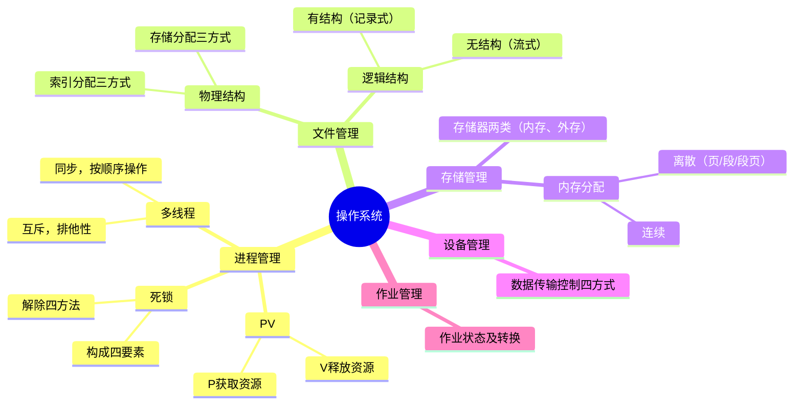
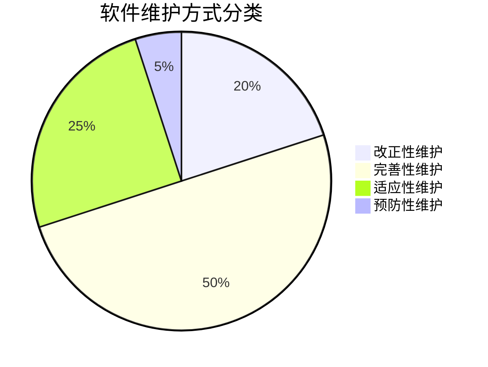

系统分析师笔记
=======================
[TOC]

# 一、信息基础知识

## 1.1 信息系统基础

信息是一种客观事物，是社会基础资源。

> 信息是不确定性的减少，或确定性的增加。

信息与数据的关系，信息是加工后的数据，数据是信息生成的材料。

信息系统，是接收输入数据，经过处理加工产生信息的系统。

信息系统工程，是以系统工程方法实现信息系统的建设过程。

信息系统生命周期：系统规划、系统分析、系统设计、系统实现、运行与维护

信息系统建设原则：高层管理人员介入原则、用户参与开发原则、自顶向下原则、工程化原则

## 1.2 系统分析师定位

系统分析师角色，既是IT专家，又是管理业务专家，具体为以下几种：

* IT专家，了解技术复杂性，对技术产品做出正确评估
* 管理业务专家，具备管理知识和经验，领导信息系统建设
* IT人员和非IT人员沟通者，解决人员之间隔阂
* 对外谈判者，解决与专业组织之间信息不对称，代表企业利益谈判
* 信息系统运行的指导者，牵扯到技术、业务、人员、制度等方面运行保障
* 信息系统技术负责人，对技术问题和义务问题的解决起关键作用

# 二、计算机体系结构

## 2.1 计算机组成
### 2.1.1 五大部分

1. 控制器: 寄存器+计数器

2. 运算器: 算数运算单元+逻辑运算单元。**控制器+运算器=CPU**

3. 存储器：存储程序、数据、中间结果。

   包括：主存储器（RAM和ROM）、辅存储器（磁盘、光盘、U盘等）、寄存器（CPU内部）、Cache（高速缓存）。

4. 输入设备，包括键盘、鼠标、扫描仪、麦克风、摄像头等

5. 输出设备，包括显示器、打印机、音箱等

[五大组成部分示例图](https://www.processon.com/view/692ea6e176df1f007f6cc8b6)

### 2.1.2 存储器存取方式
- 顺序存取，共享读写装置，线性处理，如磁带
- 直接存取，共享读写装置，数据分块，可直接定位到块，如磁盘
- 随机存取，寻址单元专有读写装置，每个寻址单元可直接访问，如主存储器
- 相联存取，寻址单元专有读写装置，每个寻址单元可直接访问，可根据内容关联选取块，如Cache

### 2.1.3 辅助存储器
* 磁带
顺序存取，容量大价格便宜适合备份存储
* 磁盘
直接存取，组成部分：组合臂、柱面、盘面（磁道、扇区），磁道从外向内0是最外层。  
- 格式化磁盘容量=n(盘面数)×f(磁道数)×s(扇区数)×b(单扇区字节数)
- 非格式化磁盘容量=盘面数×内直径周长×位密度×内外半径之间磁道数
- 存取时间，包括寻道、旋转、数据传输时间
* 磁盘阵列RAID
是多个磁盘成为磁盘组。
- RAID0，无冗余无校验，数据分散到多盘并行存取
- RAID1，磁盘镜像，每块盘有一个完全相同备份
- RAID2，海明纠错码，第2N个盘存做校验盘
- RAID3，奇偶校验并行传送，N+1盘做校验盘
- RAID4，奇偶校验独立磁盘，N+1盘做校验盘，校验盘是瓶颈
- RAID5，数据和奇偶校验信息分散到各个盘，空间利用率较高为：(N-1)/N。RAID5和4适合请求率高的应用，不适用于传输率高
- RAID6，扩展RAID5，每个数据块有2个校验保护，写入性能低于RAID5
- RAID7，异步高IO速率和传输率，多个磁盘组成一个柱子，磁盘组各自有读写通道
- RAID1+0，**两组RAID0，互相成为RAID1**，性能好可靠性高，利用率低为50%
* Cache
  采用SRAM，速度快于主存(DRAM)，处理cpu和主存之间，改善性能的依据是程序局部性原理。

  系统平均访存时间：t=h × tC + (1 - h) × tM，h为命中率,tC访问Cache时间，tM访问主存时间
- Cache映射机制，相联存储器CAM，使用地址映射，包括直接映射、全相连、组相连。
- Cache写操作，一致性方法：
  - 写直达(cache、内存同时写)
  - 写回(写cache不写主存，换出时写内存)
  - 标记法(写主存并置0失效cache，读cache时检查标记决定是否有效)

### 2.1.4 输入输出方式
1. 程序查询（最初期）
2. 中断控制（打印机扫描仪）
3. 直接存储器访问DMA
4. 通道方式
5. 外围处理机

### 2.1.5 总线与接口
* 内部总线，CPU内部
* 外部总线，CPU与内存、输入输出设备之间
总线，按供
* ABus地址总线
* DBus数据总线
* CBus控制总线

### 2.1.6 指令集
* CISC，复杂指令集，指令多，寻址方式多，支持变长指令
* RISC，精简指令集，指令少，寻址方式少（寄存器寻址、立即寻址、相对寻址），指令长度固定，存储器指令只有Load/Store，指令在一个周期内可完成，容易利用流水线，并行程度高

### 2.1.7 流水线
把一个任务分解为若干顺序执行的子任务，不同任务由不同执行机构负责，不同执行机构可并行。
* 执行时间
流水线时间取决于最慢的子任务：Nt+(k-1)t
* 流水线吞吐率
单位时间完成任务数，
* 影响流水线的因素：转移指令，共享资源访问冲突，响应中断

## 2.2 计算机分类
分类方法
### 2.2.1 flynn
根据指令流、数据流和多倍性三方面分类。4种结构：
  - 单指令流单数据流SISD，单处理机系统
  - 单指令流多数据流SIMD，并行处理机、阵列处理机，超级向量处理机
  - 多指令流单数据流MISD，没有此类机器
  - 多指令流多数据流MIMD，多处理机系统

### 2.2.2 冯氏
根据单位时间能处理的最大二进制位分类。
  - 字串位串
  - 字并位串(字宽>1，位宽=1)
  - 字串位并
  - 字并位并

> “串”=1，“并”>1。字宽是字中可处理的二进制位数，位宽是位中可处理的字数

# 三、操作系统

处理器管理、文件管理、存储管理、嵌入式系统等见[《系统架构师-知识笔记》](https://github.com/edhn3000/document/blob/master/%E5%AD%A6%E4%B9%A0%E7%AC%94%E8%AE%B0/%E7%B3%BB%E7%BB%9F%E6%9E%B6%E6%9E%84%E5%B8%88-%E7%9F%A5%E8%AF%86%E7%AC%94%E8%AE%B0.md)

# 四、软件工程

## 4.1 软件开发生命周期
主要过程：获取（需求、招投标等于客户交流）-供应（商务、计划、交付）-开发-运行-维护

软件生命周期：可行性研究、需求分析、概要设计、详细设计、实现、组装测试、确认测试、使用、维护、退役。

## 4.2 软件开发方法(4个)
### 4.2.1 净室方法
严格控制工程化软件过程达到或接近零缺陷，要求在设计中消除错误。
> 使用盒结构分析和设计模型,盒模型逐步细化，包括：黑盒->状态盒->清晰盒，逐步清晰  

### 4.2.2 结构化方法
**自顶向下，逐步求精，把大问题分解为小问题。**
结构化分析阶段，包括：结构化分析SA、结构化设计SD、结构化实现SP。

* 结构化分析SA: 分析阶段，使用图形表示用户需求，包括数据流DFD、数据字典、结构化语言、判定表等
* 结构化设计SD：设计阶段，评审和细化DFD，得出模块结构图，分解模块层次，得出合理结构，定模块接口
* 结构化实现SP：编码阶段，根据结构化编程原则来编写代码，实现设计逻辑
> 优点：每个阶段有明确任务与成果物；缺点：开发周期长，易忽视数据结构，对结构化程度低的系统开发初期不易锁定功能。  

### 4.2.3 原型法
获取基本需求后，利用可视化开发环境快速开发一个最初版本，交付用户并收集反馈，反复进行这个交付过程。
该方法适用于用户需求不明确场合。
原型分类：

- 水平原型（UI确认）
- 垂直原型（功能深度探讨）
- 抛弃型原型（探索）
- 演化型原型（不抛弃）

原型生存期：快速分析-构造-运行-评价

### 4.2.4 逆向工程法
对现有软件系统重新开发的过程。方式包括：再工程、软件重构、逆向工程。

## 4.3 软件开发模型(12个)
包括：瀑布模型、演化模型、螺旋模型、喷泉模型、智能模型、增量模型、迭代模型、构建组装模型、V模型、快速应用开发模型、敏捷方法、统一过程

### 4.3.1 瀑布模型
又称生命周期法：
- 定义（计划）
- 开发（需求/设计/编码/测试）
- 维护  

### 4.3.2 演化模型
获取用户基本需求，快速分析构造一个原型，根据用户使用过程中逐步改进，最终获得用户满意版本。

### 4.3.3 螺旋模型
**结合瀑布+演化模型**，增加**风险分析**，螺旋每转一圈需有计划、风险分析、实施、评价等，不断螺旋上升。  

### 4.3.4 喷泉模型
以用户需求为动力，以对象为驱动，认为软件开发过程是自下而上的，各节点没有明显间隙。 

### 4.3.5 智能模型
**结合瀑布+专家系统**，应用基于规则的系统，采用归约和推理机制帮助完成开发。需要有专家知识库。 

### 4.3.6 增量模型
结合瀑布+原型迭代特征，先实现用户基本需求再经过使用和评估并发布下一个增量。  
**增量VS演化**

- 共同点：两者都是迭代过程
- 区别点：增量模型强调每一个增量都是可操作产品而非原型，增量模型可将原型细化，分别开发（出一个需求开发一个）
> 增量模型对架构开发式结构要求高不易掌控。

### 4.3.7 迭代模型
将整个生命周期分为若干个冲刺，每个冲刺都是一个小的开发流程：初始-细化-构建-交付。  

### 4.3.8 构件组装（CBSD）
复用构件库的一个或多个构件来构造系统。构件和软件开发工作应分开，构件开发过程：领域分析-领域涉及-构件实现。5个阶段：需求分析和定义-体系结构-建立构件库-构建软件-测试和发布。
构建开发和软件开发应分开团队。

> 优点：提高效率，降低费用，质量较高；缺点：构件可能缺乏通用标准，引入和组装存在风险，可重用性和高效性不易协调，开发难度高，构件库质量影响产品质量

### 4.3.9 V模型（测试驱动）
以测试驱动，强调测试的作用。
|开发<-测试|对应关系|
|--|--|
|需求分析<-验收测试|检验符合最终用户需求|
|概要设计<-系统测试|检验系统符合规划说明书|
|详细设计<-集成测试|检验组成部分完好结合|
|编码实现<-单元测试|检验符合详细设计|

### 4.3.10 快速应用开发（RAD）
增量型软件开发模型，强调极短周期快速开发。复用构件增量开发，是瀑布模型的高速变种。
流程：业务建模-数据建模-过程建模-应用生成-测试与交付

### 4.3.11 敏捷开发
快速响应需求变化，强调程序员团队和业务专家紧密协作，强调面对面沟通，持续而频繁的交付，紧凑而自我组织型团队。
敏捷方法：SCRUM/极限编程/自适应/水晶方法/特性驱动
> SCRUM(产品负责人PO+小团队+增量软件开发)

### 4.3.12 统一过程（UP/RUP）
是一个通用的过程框架，可广泛用于各类软件系统。UP建模使用UML语言。  
**UP的3个显著特点：**
用例驱动、体系结构为中心、迭代和增量。

**软件过程分为4阶段：** 

初始-细化-构建-交付 

4阶段都包含基本流程环节：建模-需求-设计-实现-测试-部署-管理等，不同阶段下每个环节占比有区别，每个阶段安排一次评审。

## 4.4 软件总体规划
总体规划：确定软件发展方向及如何发展。  
规划节点：

1. 初步调查
2. 确认目标
3. 分析组成
4. 拟定方案
5. 可行性分析
6. 可行性报告 

### 4.4.1 可行性分析
3方面考虑：技术/经济/操作  
分析步骤(从核实问题到可行性报告）：

1. 核实问题
2. 分析现有系统
3. 新系统建模
4. 用户复核
5. 评价模型
6. 确定最优解
7. 草拟计划
8. 提交可行性报告

### 4.4.2 成本效益分析
两方面收益：有形、无形
#### 4.4.2.1 有形效益
货币时间价值、投资回收期和回收率等可以量化的指标  
1. 利息&利率，资金的时间价值体现为资金运用带来的利润和利息，利息是绝对尺度，利率是相对尺度，单利&复利；  
2. 折现&折现率，未来某时间点的金额折算为现在的金额，公式：金额C/(1+i)n；净现值(NPV)，项目生命周期各年净现金流按折现率折算到现值之和，净现值率(NPVR)可衡量多个投资方案优劣； 
3. 投资回收期：从项目投建开始，到项目所得净收益偿还原始投资所需时间（“收益”偿还“成本”的时间）；根据**是否考虑资金的时间价值**而分为静态投资回收期和动态投资回收期。*注意：投资回收期计算时应包括建设期（除特殊说明）。*
静态投资回收期法：（总投资/平均每年净回收）或（总投资-各年投资之和，直至全部回收）。  
动态投资回收期法：`Tp=(累计净现金流量折现值为正的起始年份-1 +|上年累计净现金流量折现值|/当年净现金流量折现值`(就是把收益转正那年的具体时间精确到小数位)
4. 投资回收率=1/投资回收期
5. 内部收益率(IRR)指资金流入现值总额等于资金流出现值总额、现值等于0时的折现率。
6. 盈亏平衡点，即销售收入等于总成本的时间点

#### 4.4.2.2 无形效益
从性质、心里方面衡量等无法量化的

## 4.5 软件设计
### 4.5.1 概要设计
设计结构，划分模块，确认模块关系。
采用图形：

- 结构图（包括模块、调用和数据）
- 层次图
- HIPO（层次图加输入输出） 

### 4.5.2 详细设计
对每个模块做详细结构和算法。 
采用图形：

- 程序流程图
- 盒图
- PAD图（Problem Analysis Diagram 问题分析图）
- PDL图（Problem Design Languate 伪代码）

### 4.5.3 设计活动
包含4个活动：
- 数据结构设计
- 软件结构设计
- 人机界面设计
- 过程设计

### 4.5.4 结构化设计
包括体系结构、接口设计、数据设计、过程设计。方法为自顶向下逐步求精和模块化。

模块：执行某一特定个任务的数据结构和程序代码。设计时原则是信息隐蔽和模块独立。
#### 4.5.4.1 内聚度7级（高->低）
* 功能内聚：**内聚最高**，完成单一供能，各部分协同工作
* 顺序内聚：处理元素必须顺序执行
* 通信内聚：处理元素集中在一个数据结构
* 过程内聚：必须按特定次序处理
* 瞬时内聚：必须在同一时间间隔执行（如初始化）
* 逻辑内聚：一组任务逻辑上相关（打开窗口前进行A、B、C操作）
* 偶然内聚：**内聚最低**，完成一组任务无相关或松散相关

#### 4.5.4.2 耦合度7级（低->高）
* 非直接耦合：**耦合最低**，互不依赖
* 数据耦合：借助参数传递数据
* 控制耦合：数据结构一部分借助接口传递
* 外部耦合：传递的信息可控制模块内部逻辑
* 公共耦合：与软件外环境有关
* 内容耦合：**耦合最高**，直接访问另一模块内部数据

#### 4.5.4.3 模块设计原则
- 大小适中
- 调用深度少
- 扇入大扇出少
- 单入口单出口
- 作用域在模块内
- 功能可预测

### 4.5.5 工作流设计
工作流(work flow)：业务过程的部分或整体在计算机应用环境下自动化，多个参与者之间按预定义的规则自动传递文档、信息或任务的过程。

## 4.6 软件测试
对软件产品进行验证和确认的活动过程。软件测试是发现和缺陷的主要手段之一。  
### 4.6.1 测试类型
动态测试、静态测试。 

静态测试：桌前检查（运行前自查）、代码审查（小组开会自讲）、代码走查（检查小组检查）  

### 4.6.2 动态测试分类
- 黑盒（功能测试、数据驱动测试），方法：等价类分析、边界值分析、错误推测、因果图
- 白盒（结构测试、透明盒测试），方法：基本路径测试、循环覆盖测试、逻辑覆盖测试
- 灰盒，结合黑盒白盒，既关注输入输出也关注内部表现，通过表征性现象、事件及标志判断程序内部运行状态

### 4.6.3 测试阶段 
- 单元测试，在详细设计阶段产生计划
- 集成测试（系统联调），在概要设计阶段产生计划
- 确认测试（需求确认），在需求分析阶段产生计划
- 系统测试，对整个产品系统进行测试，验证是否满足需求规格定义，在系统分析阶段产生计划。包含：功能测试、健壮性测试、性能测试、用户界面测试、安全性测试、安装反安装测试等

### 4.6.4 性能测试
对系统各项性能指标进行测试，验证是否达到用户的性能指标，和发现软件存在的性能瓶颈，并优化软件系统。性能测试分类：
- 负载测试，各种负载条件下的性能表现
- 压力测试，确定系统瓶颈和最大服务级别
- 强度测试，系统资源特别低情况下的运行情况测试
- 容量测试，系统可同时处理的在线用户

### 4.6.5 测试自动化
使用测试工具和开发程序自动完成测试。

### 4.6.6 软件调试：
- 蛮力法（人工找）
- 回溯法（从出错点向回找）
- 原因排除法（假定原因并排除）

### 4.6.7 软件测试过程
软件测试过程阶段：测试计划、测试设计、测试执行、测试评估

## 4.7 系统运行和维护
新旧系统转换：直接、并行、逐步替代

### 4.7.1 软件维护 
可维护性：纠正程序错误和满足新需求进行修改的容易程度。相关概念：可理解性、可测试性、可修改性。  
软件维护在软件开发阶段中占比最大，可达60%~80%

软件维护的方式分为四类：改正性维护（改bug）20%，**完善性维护（补充需求）50%占比最大**，适应性维护（适配环境）25%，预防性维护（预防问题）5%

### 4.7.2 数据的转换和迁移

系统转换是指新系统开发完毕后，取代现有系统的过程，包括数据、人员和设备的转换。

数据迁移前的准备工作

* 待迁移数据源的详细说明，包括数据的存放方式，数据量和数据的时间跨度。

* 建立新旧系统数据库的数据字典，对现有系统的历史数据进行质量分析，以及新旧系统数据结构的差异分析。

* 新旧系统代码数据的差异分析。

* 建立新旧系统数据库表的映射关系，对无法映射字段的处理方法。

* 开发或购买、部署ETL工具。

* 编写数据转换的测试计划和校验程序。

* 制定数据转换的应急措施。

### 4.7.3 遗留系统处理办法

* 高水平高价值->改造
* 高水平低价值->集成
* 低水平高价值->继承（将具备高商业价值的分析内容留下来，所以是继承）
* 低水平低价值->淘汰

## 4.8 软件过程管理

### 4.8.1 软件成熟度

能力成熟度模型CMM：初始、可重复（有章可循）、已定义（标准）、已管理（定量）、优化级（持续改进）  

能力成熟度模型集成CMMI：初始、已管理级、严格定义级、定量管理级、优化级  

### 4.8.2 软件过程评估

CMM模型评估方法：

1. 成立评估小组
2. 参评单位填写成熟度调查问卷
3. 评估小组分析调查问卷
4. 评估小组现场访问、召开座谈会、审核过程文档，判断KPA实践活动是否已达目标
5. 整理调查结果，撰写调查报告
6. 绘制KPA剖面图，提交结论性意见

Trillum模型，以CMM为基础并有新的发展：

1. 模型架构建立在路线图基础上
2. 模型不仅适用于软件，也适用硬件
3. 模型强调以用户关注为焦点
4. 模型面向通用产品

其他方法：Bootstrap方法、ISO/IEC 15004标准

## 4.9 软件重用和再工程

### 4.9.1 软件重用

软件重用是开发过程中重复使用相同或相似的软件元素的过程，包括领域知识、开发经验、设计经验、体系结构、需求文档、设计文档、程序代码、测试用例等。

软件重用三种模型：组装模型、类重用模型、软件重用过程模型

领域工程：分析过程、开发软件构建、传播软件

### 4.9.2 逆向工程

即对一项目标产品进行逆向分析和研究，得出产品的流程、结构、功能特性、技术规格等设计要素，制作出类似但不完全一样的产品。

逆向工程实现方法：分析信息交换过程、反汇编、反编译

### 4.9.3 再工程

再工程是对软件逆向工程的扩充，逆向工程提取信息后，再重构为新形势代码的开发过程。

软件再工程阶段包括再分析、再编码、再测试。

## 4.10 软件产品线

产品线是一个产品集合，这些产品共享公共的、可管理的特征集。

产品线过程模型包括：双生命周期模型、SEI模型、三生命周期模型

产品线双生命周期模型：

* 领域工程：领域分析、领域设计、领域实现
* 应用工程：需求分析、系统设计、系统实现

产品线SEI模型三个部分：核心资源开发、产品开发、管理。SEI模型特点是三个部分可以任意次序发生，高度重叠，循环重复。

产品线三周期模型（大型软件产品线）：

* 企业工程：运作计划、市场计划、企业架构计划
* 领域工程：产品线确认、领域分析、领域设计、领域实现
* 应用工程：市场分析计划、需求分析、系统设计、系统实现

# 五、系统规划与分析

系统规划的主要任务是对企业环境、目标、现有系统进行调查，根据企业目标确定信息发展战略，对建设新系统做出分析和预测。

系统规划的步骤：

1. 对现有系统进行调查
2. 分析和确定系统目标
3. 分析子系统组成和基本功能
4. 拟定系统实施方案
5. 进行系统可行性研究
6. 制定系统建设方案

## 5.1 项目的提出和选择

项目的提出来源于企业发展战略、经营管理需要以及外部环境变化，是系统建设的起点。

项目选择是在多个候选项目中进行比较和分析，确定是否实施以及优先实施哪一个项目的过程。

项目选择需要综合考虑系统建设的必要性、可行性和预期效益，其结果可能是批准立项、暂缓实施或否决项目。

## 5.2 系统分析

系统分析是在系统规划和项目立项之后，对系统进行全面调查和分析的过程。

系统分析的任务是在调查研究的基础上，明确系统的功能要求、数据要求和处理要求，为系统设计提供依据。

系统分析强调从整体角度理解系统，而不是对局部功能进行简单描述。

## 5.3 数据与数据流程分析

数据与数据流程分析，目标是理解系统中数据的来源、传输、存储和处理，以及它们在系统中的使用和转换。

数据流包括以下方面：数据源、数据传输、数据转换、数据存储、数据输出。

逻辑数据流描述数据在系统中输入、处理、转换和输出的过程，以及数据处理的逻辑关系。

数据流守恒，指数据流动过程中总量保持不变，特征包括：

* 输入等于输出
* 处理后等于输入加上增量
* 处理前等于处理后加上丢失量

数据流图DFD(Data Flow Diagram)，是描述系统功能的图形化工具。[示例](https://www.processon.com/view/692ad5068a72ba53d04bdd8b)

数据流图四种符号：

* 数据流，用箭头表示
* 进程，用圆角矩形表示
* 数据存储，用长方形表示
* 外部实体，用矩形表示

数据汇总分析，是对一组数据基尼系那个综合整理、归纳和分析，以求得数据之间关系和趋势规律。步骤：

1. 收集系统的数据资料
2. 自顶向下对数据项整理
3. 原始数据和最终输出分类整理
4. 确定数据字长和精度

数据属性分析，含数据静态分析、数据动态分析、数据存储分布分析

数据流程分析，内容包括：

1. 收集系统全部输入单据和报表

2. 明确处理过程中的方法和计算方法

3. 确定单据报表等数据的发生频率、高峰期、高峰量等

4. 注明数据类型、长度、取值范围

数据流程分析方法：结构化分析SA、面向对象方法OO

## 5.4 成本效益分析

成本效益分析是对系统建设所需成本和预期效益进行分析与比较的过程，是系统决策的重要依据。

成本包括系统开发成本、运行维护成本等，效益包括直接效益和间接效益。

通过成本效益分析，可以判断系统建设在经济上的合理性。

## 5.5 系统方案建议

系统方案建议是在系统分析和成本效益分析的基础上，对系统建设提出的综合性建议。

系统方案建议通常包括是否建设系统、建设方式以及实施步骤等内容。

系统方案建议报告包含如下内容：

* 前置部分，包括标题、目录、摘要
* 系统概述，包括方案目的、对问题的描述、项目范围等
* 系统研究方法，解释系统建议方案报告中的信息出处，研究如何进行
* 候选方案及可行性分析
* 建议方案，给出建议理由
* 结论，再次指出开发目的和建议方案，强调必要性和可行性
* 附录，列出阅读者可能感兴趣的信息

# 六、软件需求工程

包括需求开发、需求管理。

- 需求开发：获取、分析、定义（编写规格说明书）、验证
- 需求管理：定义基线、需求变更、需求跟踪

## 6.1 业务流程分析

1. 调查基本情况
2. 描述现有业务流程
3. 确认现有流程
4. 分析流程
5. 发现问题并提出解决方案
6. 提出优化后流程  

## 6.2 数据流图DFD

4种基本符号：数据流（箭头）、加工（圆圈）、数据存储（直线段）、外部实体（数据源及数据终点，用方框）。

[示例数据流图](https://www.processon.com/view/692ad5068a72ba53d04bdd8b)

## 6.3 数据字典

数据信息的集合，对数据项、数据结构、数据流图的描述

## 6.4 需求跟踪

正向跟踪、逆向跟踪

# 七、数据通信与计算机网络

## 7.1 数据通信基础知识

信道：信源->信宿通信线路  

模拟通道传输数据方法：调幅AM、调频FM、调相PM 

数字通道传输模拟数据：调制PCM (模拟变数字：采样、量化、编码)

模拟通道传输数字：载波传输，改变幅度频率相位  

数字通道传输数字：用信号表示数字信息，如单极性编码、双极性编码等。  

数字编码：单极性，极性、双极性、归零、不归零、双相码（实现自同步，曼彻斯特原理）  

## 7.2 网络体系结构

局域网LAN：距离100米~2.5万米，曼彻斯特(低到高0，高到低1)，差分曼彻斯特(曼码+遇1翻转)； 曼码效率50% 

广域网WAN：距离远，mbnb编码（效率较高，抗噪较差） 4B/5B, 8B/10B

城域网MAN：介于局域网和广域网之间

## 7.3 网络开发过程模型

五阶段周期模型

1. 需求分析
2. 现有网络系统分析，分析目的是描述资源分布，升级时尽量保护已有投资。产出通信规范说明文档。
3. 确定网络逻辑结构，根据需求规范和通信规范选择一种比较适宜的网络逻辑结构，并实施后续的资源分配计划，安全规划等内容。产出逻辑设计文档。
4. 确定网络物理结构，确定具体的软硬件，连接设备，布线和服务部署方案。
5. 安装和维护。实施环境该准备，设备安装调试的过程投入运行后，做故障监测和故障恢复，网络升级，性能优化。
6

## 7.4 5G技术
5G 速率高，容量极大，时延极低

性能目标：
  高数据速率，减少延迟
  节省能源，降低成本
  提高系统容量和大规模设备连接

应用场景：
  EMBB，增强型移动带宽
  URLLC，高可靠和低延迟通信
  MMTC，大规模机器类型通信

几个指标：
  峰值，10Gbps
  流量密度，30
  连接密度，100万/平方公里
  时延 < 1毫秒
  移动性 500km/h
  用户体验速率 0.1~1Gbps

## 7.5 IPsec
互联网安全协议（Internet Protocol Security）
协议组成部分：

1. 认证头（AH），提供数据完整性、消息认证以及防重放攻击
2. 封装安全载荷（ESP），提供机密性、数据源认证、无连接完整性、防重放和有限的传输流机密性
3. 安全关联（SA），提供算法和数据包，提供AH、ESP所需参数
4. 密钥协议（IKE），提供对称密码的钥匙的生存和交换

IPsec模式：
- 传输模式中，IP头无加密，只对IP数据进行加密
- 隧道模式中，IPsec对原来的IP数据报进行封装和加密，通过AH和ESP报头与其他IP报头来封装整个IP数据包。外部IP报头的IP地址是隧道终结点，封装的IP报头和IP地址是最终能源地址和目标地址

防火墙的性能特点，主要由工作层次和采用的机制决定。- 工作层次低，则效率高，安全性低
- 代理机制具有内部信息隐藏的特点，安全性高，效率低
- 过滤机制，效率高安全性低

# 八、项目管理

## 8.1 项目管理基本概念
项目是在特定条件下，为达成特定目标的一次性任务，包括多个相关工作的总称。
项目三要素：范围、时间、成本。
项目生命周期的四个阶段：概念阶段、开发阶段、实施阶段、结束阶段。

项目管理的作用：提高效率、减少浪费、目标明确、行为有度。
项目开发计划的内容：工作计划、人员组织计划、设备采购和资源供应计划、配置管理计划、进度安排计划、成本投资计划、质量保证计划、风险管理计划、文档编制计划、支持计划。

## 8.2 配置管理

软件配置管理是通过版本控制、变更控制等手段，保证软件产品完整性和可追溯性的过程。
配置管理过程：包括配置标识、配置控制、配置状态报告、配置审核等。

## 8.3 成本管理

成本管理是确保项目在批准的预算内完成的过程，包括成本估算、预算和控制。

成本管理三大步骤：成本估算 → 成本预算 → 成本控制

估算是根据以往经验、参数模型或专家判断预测每项活动的成本；

预算是将这些估算汇总、形成成本基准；

控制是通过比较计划值、实际成本与挣值判断项目是否超支或节约，并采取调整措施

## 8.4 质量管理

质量管理是确保软件产品满足质量要求的过程，包括质量保证和质量控制。

软件质量模型：包括功能性、可靠性、易用性、效率、可维护性和可移植性等方面

质量管理计划：明确质量标准和目标，制定质量管理活动和评审流程。

## 8.5 风险管理

风险管理是识别、分析和管理项目风险的过程，以减少风险对项目目标的负面影响。

风险管理计划：描述风险管理的角色、职责、预算和风险类别。

风险识别：系统化识别项目中的已知和可预测风险。

## 8.6 组织结构

项目组织结构模式包括职能型、项目型、矩阵型

职能型：以职能部门作为承担项目任务的主体，可以充分发挥职能部门的资源集中优势，缺点客户利益和职能部门的利益可能发生冲突。

项目型：项目经理对项目可以全权负责，可以根据项目需要随意调动项目的内部资源或者外部资源，缺点对于每一个项目型组织，资源不能共享

矩阵型：专职的项目经理负责整个项目，以项目为中心，能迅速解决问题；缺点容易引起职能经理和项目经理权力的冲突

## 8.7 WBS工作分解结构

把项目整体或主要可交付成果分解为容易管理的、方便控制的若干子项目，子项目需要继续分解为工作包。持续这个过程，直至整个项目路分解为可管理工作包，这些工作包整体就是项目所有工作范围。

WBS目的和用途：

1. 明确和准确说明项目范围
2. 为各独立的单元分派人员，规定这些人员的相应职责，可以确定所需技术和人员
3. 对进行时间、费用和资源需求量化评估
4. 确定项目进度测量和控制基准
5. 将项目工作与项目财务账目联系起来
6. 清楚定义项目边界
7. 确定工作内容和工作顺序
8. 估计项目整体和全过程的费用
9. 有助于防止需求蔓延

# 九、企业信息化

## 9.1 企业信息化工程

简称EIE，是指将**信息技术、自动化技术、现代管理技术与制造技术**相结合，改善制造企业经营、管理、产品开发和生产各个环节，提高生产效率、产品质量和企业创新能力，降低消耗，带动产品设计方法和设计工具的创新、企业管理模式的创新、制造技术的创新以及企业间协作关系的创新，从而实现**产品设计制造和企业管理的信息化、生产过程智能化、制造装备的数控化以及咨询服务的网络化**，全面提高我国企业竞争力。

## 9.2 信息战略规划

企业战略与信息化战略集成方法，包括：

* 业务路线：业务与IT整合，是一种以业务为导向的、全面的IT管理咨询实施方法论
* IT技术路线：企业IT架构，帮助企业制定IT战略，对其投资决策进行指导
  企业战略=>企业信息化战略=>信息系统战略=>单个信息系统开发

## 9.3 企业信息化系统

客户关系管理CRM，将客户看做企业的重要资源，以客户为中心，通过信息技术提升客户满意度和忠诚度。功能包括客户服务、市场营销、销售管理、客户分析。

供应链管理SCM，集成管理思想和方法，优化供应链中的信息流、物流和资金流。SCM包括五个基本内容：计划、采购、制造、配送、退货。

产品数据管理PDM，管理产品相关信息和过程。包括数据库和文档管理、产品结构管理、生命周期管理。

产品生命周期管理PLM，支持产品全生命周期的协作研发、管理、分发和使用。包括数据管理、流程管理、协同工作。

知识管理，对有价值的信息进行管理，包括知识的识别、获取、分解、储存、传递、共享、价值评判、保护。知识可分为显性知识和隐性知识，显性知识指所有可被文字表达的知识，隐性知识包括技术层面的非正式技巧和认知层面的信念思想等

商业智能BI，即从数据中提取有用的信息，并基于信息采取明智的行动。BI系统主要包括4个阶段：数据预处理、建立数据仓库、数据分析、数据展现。BI三大组成部分：数据仓库、OLAP、数据挖掘。

企业门户EP，企业优化业务模式、扩展市场驱动、开衫客户服务、提升企业形象的手段。EP分类：企业网站、企业信息门户、企业知识门户、企业应用门户。

## 9.4 电子商务

电子商务是利用计算机技术、网络技术、通信技术等实现商务过程。

电子商务分类：B2B、B2C、C2C  

电子商务特征具备普遍性、方便性、整体性、安全性、协调性。

电子商务优势，降低营销成本、提高销售效率、扩大销售渠道、提高服务质量，可用大数据分析。

## 9.5 电子政务

电子政务是政府机构应用现代信息和通信技术，实现政府组织机构和工作流程的优化，提供优质的符合标准的管理和服务。

电子政务分类：G2G、G2E、G2B、G2C

电子政务建设过程：以用户为中心、引进客户关系管理技术、政府门户

电子政务技术模式：网络管理模式、信息资源管理模式、应用开发模式、电子政务安全体系、电子政务标准化

## 9.6 数据中台

核心四大能力
1. 数据汇聚整合，解决企业数据孤岛，使内外部数据可全局规划，对数据进行整合完善，提供适用、适配、成熟、完善的一站式大数据平台。
2. 数据提纯加工，推动业务数据向数据资产转化，成为完整的数据资产体系
3. 数据服务可视化，提供便捷快速的数据服务能力，能够迅速开发数据应用，支持数据资产场景化的快速输出。
4. 价值变现
    企业期待数据中台能提供跨部门的普适性业务价值能力，更好地管理数据应用，将数据洞察变成直接驱动业务行动的核心能力。

## 9.7 TOGAF架构

企业信息架构是将企业业务实体抽象为信息对象，将企业运作模式抽象为信息对象的属性和方法，建立面向对象的企业信息模型。

企业信息架构实现**从业务模式向信息模式的转变，业务需求向信息功能映射，企业基础数据向企业信息的抽象**。

# 十、多媒体

媒体分类：

* 感觉媒体（作用与人的感官如音乐/图形）
* 表示媒体（表示感觉媒体的数据编码wav、jpg等）
* 表现媒体（进行信息输入输出的媒体如键盘鼠标摄像机）
* 存储媒体（存储媒体的物理实体）
* 传输媒体（传输表示媒体的物理实体如光缆）  

媒体压缩：

* 无损压缩（可逆无失真，哈夫曼编码、算数编码、行程编码）
* 有损压缩（压缩了熵，不可逆，分为特征抽取和量化两类）  

音频技术：音强（强度）、音调（频率）、音色（感觉特性）  

音频编码文件字节数：采样频率×采样位数×声道数÷8  

颜色属性：色调、明度、饱和度

流媒体传输方式：顺序流传输、实时流传输

流媒体协议：PNA(Real专用）、MMS、RTP(实时传输协议)、RTCP(实时传输控制)、RTSP(实时流协议)

# 十一、信息安全

## 11.1 数据安全与保密

对称加密算法，加密和解密的密钥相同，常见算法：IDEA、DES

非对称加密算法，加密和解密使用不同密钥，基于大数分解为两个素数原理制作一对密钥，加解密速度相对慢，常见算法：RSA

数字签名，对数据单元做密码变化，附加在数据单元上。用于确保数据传输完整性、认证发送者身份、防止交易抵赖，基于对称加密和非对称加密都可实现数字签名。

数字签名算法包括：

* 杂凑算法，使用Hash散列函数
* 消息摘要算法，如MD5(输出128位摘要)
* 安全散列算法(SHA), 如SHA-1, SHA-224, SHA-256, SHA-384, SHA-512

数字证书，由CA(Certificate Authority)结构签发，遵从X.509体系标准，证书包括版本号、序列号、签名算法、发行者名称、有效期、主体名称、主体公钥、发行者标识、主体标识、发行者签名（即CA机构）等信息

数字证书吊销，因证书过期、私钥泄露、用户放弃CA等原因，CA机构维护证书吊销列表供查询

密钥管理体制：KMI、PKI、SPK

## 11.2 网络安全技术

网络安全技术用于保护网络系统在传输和访问过程中的安全性，防止非法访问、篡改和破坏。

防火墙是位于多个网络之间，通过控制网络边界的数据流，实现对内外网络访问的隔离和过滤。防火墙可分为两类：网络级防火墙、应用级防火墙。

防火墙实现模式：

* 宿主机模式，使用多网卡主机作为防火墙，连接到不同网络，成为堡垒主机
* 屏蔽主机模式，由包过滤路由器和堡垒主机组成，在路由器上设置过滤规则
* 屏蔽子网模式，采用两个包过滤路由器和堡垒主机组成，在内外网之间建立一个被隔离的子网

虚拟专用网VPN(Virtual Private Network), 用于连接两个专用网，通过可靠的加密技术，在不安全的公共网络上建立安全的通信环境。

VPN关键技术：

* 隧道技术，点对点连接，建立数据通道
* 加解密技术，实现加密通信
* 密钥管理技术，在公用网络上传递密钥而不被窃取
* 身份认证技术，比如基于口令认认证
* 访问控制技术，限制用户对网络信息或资源的访问

入侵检测系统通过监测网络或主机行为，识别潜在的入侵行为并进行告警。

## 11.3 访问控制技术

访问控制技术用于限制主体对客体的访问权限，保证资源不被非法访问和使用。

访问控制的三要素：

* 主体，对其他实体施加动作的实体，即访问者
* 客体，接受其他实体访问的被动实体，即被访问者
* 访问控制策略，主体对客体操作行为集合的约束条件

访问控制策略包括：登录访问控制策略、操作权限控制策略、目录安全控制策略、属性安全控制策略、服务器安全控制策略

访问控制分类：

* 自主访问控制，由资源所有者决定访问权限，灵活性高但安全性较弱。
* 强制访问控制，基于安全级别和访问规则进行控制，安全性高但灵活性较差。
* 基于角色的访问控制，通过角色关联权限和用户，实现权限管理的集中和简化。

## 11.4 容灾与恢复技术

容灾备份用于在系统发生灾难性故障时后能够恢复，对系统进行全面备份，包括数据、应用程序、数据库、系统参数等，以便能够恢复整个系统。

灾难恢复的目标是在可接受的时间内恢复系统功能和数据。

信息系统灾难恢复规范GB/T 20988-2007将灾难恢复划分为6个等级：

1. 基本支持
2. 备用场地支持
3. 电子传输和设备部分支持
4. 电子传输及完整设备支持
5. 实时数据传输及完整设备支持
6. 数据零丢失和远程集群支持

容灾技术分类：硬件远程数据复制、软件远程实时数据复制

## 11.5 系统可靠性

系统可靠性是指系统在规定条件和规定时间内无故障运行的能力。

可靠性通常通过冗余、容错和故障检测等技术来提高。

系统可靠性是系统可用性的重要基础。

系统可靠性指标：

* 平均无故障时间 MTTF，MTTF=1/λ失效率
* 平均故障修复时间 MTTR，MTTR=1/μ修复率
* 平均故障间隔时间 MTBF， MTBF=MTTR+MTTF≈MTTF(当MTTR很小时)

系统可用性=MTTF/(MTTR+MTTF)×100%=MTTF/MTBF×100%

## 11.6 冗余技术

冗余技术通过配置多余的部件或系统，提高系统在部件失效情况下的运行能力。

冗余技术：

* 结构冗余，静态冗余（三模/多模）、动态冗余（发现错误时用备用块顶替）、混合冗余
* 信息冗余，在正常所需信息外，再添加一些信息保证正确性，如纠错码
* 时间冗余，以时间为代价减少冗余开销
* 冗余附加，指为实现冗余二附加的资源和技术

合理的冗余设计可以提高系统可靠性，但会增加系统成本。

## 11.7 容错技术

容错技术是指系统在发生局部故障时，仍能继续提供服务的技术。

主要容错技术：

* N版本程序设计，指N个有相同功能的程序执行一项计算，通过多数表决来选择
* 恢复方块，属于后恢复策略，提供具有相同功能的主块和后备块，主块先运行并执行验证，如果没有通过验证，则由后备块运行，直到通过测试或没有后备块结束
* 防卫式程序设计，在程序中包含错误检查代码和错误恢复代码，当发生错误时，程序撤销错误状态，恢复到已知的正确状态。实现策略包括错误检测（比如插入断言）、破坏估计、错误恢复。

# 附一、案例分析
1. 结构化分析。问题分析阶段完成的4个任务：研究问题领域、分析问题和机会、制定改进目标、修改项目计划。
    因果分析法是问题分析的重要技术，可得出对系统问题的理解，有助于提出创造性方案，分析内容包括：问题与机会、原因与结果、改进目标、系统约束
    系统约束包含：时间约束、成本约束、功能约束、质量约束

2. 结构化分析VS面向对象分析
    结构化分析：结构化、模块化的自顶向下分析，功能分解到模块，使用ER图、DFD图
    面向对象分析：确定概念类，建立交互关系，使用用例图、交互图
     性能扩展技术：服务器集群技术、库表散列、负载均衡、CDN内容分发、网络架构缓存、（异步消息队、数据切分）

3. MIS系统。数据库视图，动态产生结果集、使用灵活可定制数据、管理方便简化数据操作，可合并分立数据、创建分区视图，对数据提供安全保护：
    多表数据不一致性问题的解决：应用程序实现、触发器实现、物化视图实现。

4. REST风格原则：所有事物可抽象为资源；每个资源有唯一标识；通过通用的借口对资源操作；资源操作不会改变标识；操作无状态；

5. 微服务包含资源、资源API。优点：服务拆分解决单体复杂性，服务独立开发独立自由选型，独立部署依赖少，独立扩展；缺点：有些系统无法拆解微服务，部署复杂度高、分布式数据一致性问题。

6. 数据库设计阶段：概念设计（ER模型DBMS无关）、逻辑设计（特定DBMS支持的模型）、物理设计（具体存储结构和技术相关）。范式：1范式不可再分，2范式非主全依赖主，3范式无传递依赖

7. 反规范化：冗余、派生、重组、分割。水平分区为：范围分区、哈希分区、列表分区

8. 改进方案：负载均衡、缓存服务器、分布式存储、Web应用服务器、分布式数据库。

    分布式数据库将数据分散存储在一组数据库上，分散在不同计算机，每个节点可执行局部应用，也可执行全局应用，采用技术包括数据分片、查询优化、读写分离等技术

9. 可行性分析包括技术分析，投资收益分析，社会可行性，执行可行性，使用可行性

# 附二、案例题
## 2.1 需求分析（数据流图）
### 2.1.1 需求分析过程
1. 绘制系统上下文范围关系图
2. 创建用户界面原型
3. 分析需求的可行性
4. 确定需求的优先级
5. 为需求建立模型
6. 创建数据字典
7. 使用QFD质量功能部署

### 2.1.2 数据流图DFD
数据流图DFD用于表示信息系统中的数据流，表达了系统数据从输入到存储之间所涉及的程序。数据流图包含数据流、加工、存储、外部实体。

DFD是理解和表达用户需求的工具，是需求分析的手段，DFD简明易懂，用户也容易理解，系统分析师可以通过DFD与用户进行交流。 

DFD描述了系统内部逻辑过程，是需求分析结果的表达工具，也是系统设计的重要参考，是数据起点 

DFD是存档的资料，可作为进一步修改可充实开发的依据。

## 2.2 用例图
包含参与者、用例、通信关联。
- 参与者，是存在于系统外部并与系统交互的任何事物
- 用例，表示系统所能提供的服务，定义了系统如何被使用
- 通信关联，表示参与者与用例之间的关系，或用例与用例之间的关系  

OOA方法中，构建用例模型一般需要4个阶段：
1. 识别参与者
2. 合并需求**获得用例**
3. **细化用例**描述
4. 调整用例模型

### 2.2.1 面向服务架构SOA
SOA是一个组件模型，将应用程序的不同单元进行拆分为服务，通过服务之间定义良好的接口和协议联系起来。接口是采用中立的方式进行定义的，应该独立于实现服务的硬件平台、操作系统和编程语言，使得构建系统中的各种服务可以一种统一和通用方式进行交互。 

ESB总线的作用：

1. 是SOA的一种实现方式，起到总线作用，将各种服务进行了解整合；
2. 描述服务的元数据和服务注册管理；
3. 在服务请求者和提供者之间传递数据，以及对数据进行转换的能力
4. 发现、路由、匹配的能力，支持服务之间动态交互，解耦服务请求者和服务提供者。并可提供一些高级的安全支持，服务质量保证、可管理型和负载均衡等。

ESB企业总结需要具备的功能：
1. 服务统一管理，提供统一标准化可靠可扩展的服务管理平台
2. 集成服务，提供服务集成，支持服务分解，服务调度、路由、封装等
3. 提供公用服务，如认证、日志
4. 服务协议转换，把不同协议转换为标准报文，屏蔽差异
5. 服务监控，提供服务等级管理、流量管理、实时监控、报警与交易分析。
6. 安全体系，提供多种安全机制，并能支持第三方呢安全系统集成

可实现信息系统数据交互安全性的手段：
1. 通信安全，引入https协议或采用加密技术对数据传输过程加密
2. 完整性，采用信息摘要技术对重要信息进行完整性验证
3. 身份鉴别，交易类敏感信息采用数字签名机制
4. 存储加密，敏感数据采用加密算法加密存取
