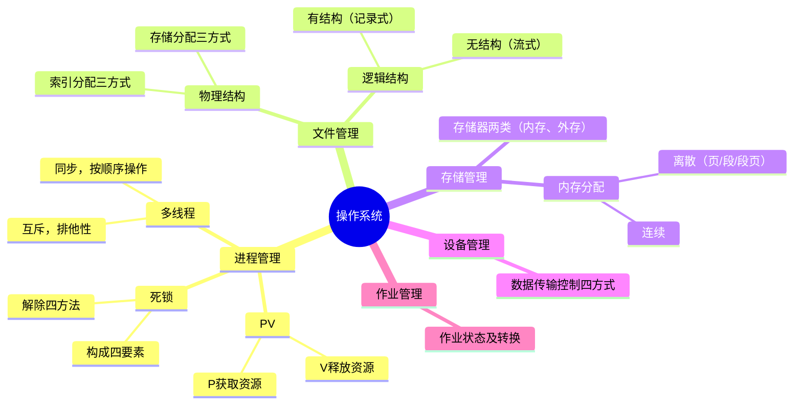
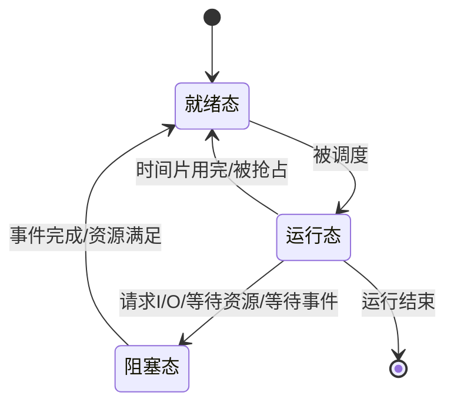
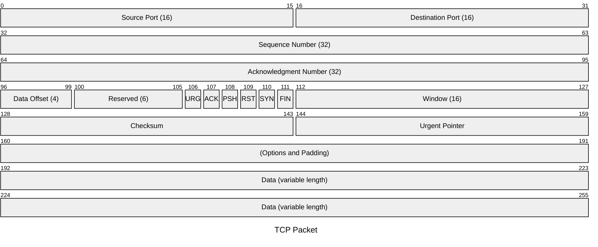
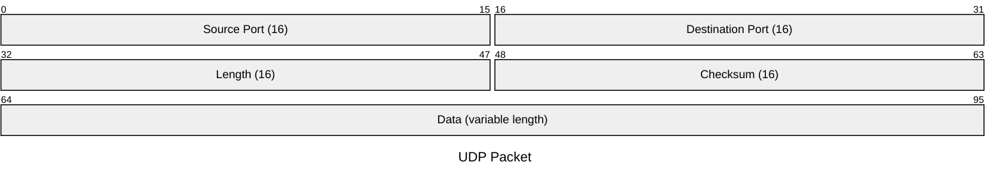

系统架构师-知识笔记
=======================

[TOC]

# 一、计算机体系结构

## 1.1 计算机组成

计算机五大部分
1. 控制器: 寄存器+计数器

2. 运算器: 算数运算单元+逻辑运算单元。**控制器+运算器=CPU**

3. 存储器：存储程序、数据、中间结果。

   包括：主存储器（RAM和ROM）、辅存储器（磁盘、光盘、U盘等）、寄存器（CPU内部）、Cache（高速缓存）。

4. 输入设备，包括键盘、鼠标、扫描仪、麦克风、摄像头等

5. 输出设备，包括显示器、打印机、音箱等

[五大组成部分示例图](https://www.processon.com/view/692ea6e176df1f007f6cc8b6)

指令集系统  
* CISC(Complex Instruction Set Computer)， 指令数量多(100~250条)，寻址方式多，指令长度可变，指令可处理主存数据，以微程序控制为主
* RISC(Reduced Instruction Set Computer)， 指令数量少，寻址方式少（寄存器寻址、立即数寻址、相对寻址），指令长度固定，单周期指令执行，以硬布线逻辑控制为主

总线  
计算机总线是一组能为多个部件共享的信息传输线路。
总线可分为地址总线、数据总线、控制总线。

## 1.2 存储器系统

包括主存、辅存、Cache存储器。  
存储器中数据存取方式
- 顺序存取，共享读写装置，线性处理，如磁带
- 直接存取，共享读写装置，数据分块，可直接定位到块，如磁盘
- 随机存取，寻址单元专有读写装置，每个寻址单元可直接访问，如主存储器
- 相联存取，寻址单元专有读写装置，每个寻址单元可直接访问，可根据内容关联选取块，如Cache

## 1.3 流水线
流水线把一个任务分解为若干顺序执行的子任务。
流水线将工作氛围N个阶段，其中最耗时的那一段时间为流水线周期。
> 100条执行，每条取指2ms，分析4ms，执行1ms，则流水线周期4ms

流水线执行时间=第1条指令执行时间+(n-1)×流水线周期

> 如上例子，100条指令执行时间=2ms+4ms+1ms+(100-1)×4ms=403ms

# 二、操作系统

## 2.1 进程管理

### 2.1.1 进程概念

进程是操作系统重独立运行和分配资源的基本单位，进程管理也可被称为处理机管理。
进程的状态转换，进程包括三种状态：就绪态、运行态、阻塞态。

### 2.1.2 PV&多线程

PV操作

* P(Proberen)获取资源（等待资源），资源-1，当<0阻塞进程；  
* V(Verhogen)释放资源，资源+1, 当>=0唤醒等待进程 

线程同步与互斥，线程互斥是保证共享资源同一时间只被一个线程访问，强调排他性；线程同步是多线程有序操作共享资源，在互斥的基础上有协作关系。

信号量(Semaphore)是一种变量，控制对共享资源的访问，作用包括：互斥（访问共享资源）、前序（进程顺序执行）、同步（进程合作）  

临界资源指并发编程中多线程共同访问的资源 ；

临界区指访问共享资源的代码区域

### 2.1.3 死锁
死锁四个条件：

* 互斥条件，资源只能被个进程使用；

* 请求并保持，请求新资源，同时保持已有资源；
* 不可剥夺，已占资源不可被剥夺，只能自己释放；
* 环路等待，进程间形成环路等待链；

解除死锁四种方法：

* 预防，提前考虑死锁条件并避免，比如不使用独占方式访问资源，部分场景适用；
* 避免，银行家算法，当资源分配时动态检查分配后是否安全，进而决策分配；
* 检测，允许死锁发生后，检测死锁，采取措施；
* 解除，当检测到死锁后，执行解除操作如强制解除资源；

## 2.2. 文件管理

### 2.2.1 文件逻辑结构

可分为：无结构文件（流式），有结构文件（记录文件）
记录文件可分为：顺序文件、索引顺序文件、索引文件、直接文件

### 2.2.2 文件物理结构
文件存储分配方式：
* 顺序分配，建立时指定长度，分配连续的物理块，不可动态增长；
* 链接分配，文件的每个物理块通过指针连接，形成链接队列，可解决文件增长问题，但不利于随机存取；
* 索引分配，为文件建立索引表，指出每个文件块的位置，利于随机存取；

文件索引分配：

* 直接索引，索引结点指向一个索引块，索引结点直接指向文件的物理磁盘块地址
* 间接索引，可有多级间接索引，索引结点指向第一层索引块，第一层索引块指向后续层索引块，最后一层索引指向物理磁盘块
* 混合索引，混合使用直接索引和间接索引方式

索引计算：一级索引计算：`块长*块长/块号长`；二级索引计算：`块长*(块长/块号长)*(块长/块号长)`
存储空间管理：空闲表和空闲链法、位示图法、成组链接法；

## 2.3. 存储管理
### 2.3.1 存储器分类

* 内存储器（内存），处理器可直接存取内存
* 外存储器（设备），如软盘硬盘光盘磁带等，处理器不能直接访问，需通过启动IO设备才能进行内存、外存交换

### 2.3.2 内存分配

* 连续分配，包括单一连续、固定分区、动态分区、可重定位分区

* 离散分配，包括分页式、分段式、段页式

分页式：将程序逻辑空间和物理空间划分为若干页面，页式物理单位，页大小固定。地址变换：设地址A，页面大小L，页号P=A/L， 页内地址D=A%L。页面调度算法：随机RAND、先进先出FIFO、最近最少使用LRU、最优OPT*（类似LFU）*。

分段式：按逻辑意义上有意义的段来划分，如主程序段、子程序段、数据段、堆栈段、常量段、全局变量段等，段是逻辑单位，段大小不固定。段地址 = 段基址 + 段内偏移。

段页式：结合段式和页式的产物，先分段，段内再分页。段页式地址结构：段号+段内页号+页内地址

## 2.4 设备管理

设备管理主要任务之一是控制设备和内存或CPU的数据传输。

数据传输控制方式：程序控制、中断控制、直接存储访问DMA、通道方式

虚设备和SPOOLING(Simultaneous Peripheral Operation On Line)假脱机，利用外围控制机将低速IO设备的数据传输到高速设备上或反向传输。

## 2.5 作业管理

作业是完成一个用户的计算任务所做的工作总和。

作业状态及转换：提交状态、后背状态、执行状态、完成状态。

# 三、数据库

## 3.1 模式与范式
数据库模式：外模式（用户模式）、模式（概念模式）、内模式（存储相关）  
数据模型  

* 域（相同数据类型的值集合）
* 候选码（唯一确定一个元组，唯一键）
* 主码（候选码中选一）
* 关系模型R（U属性名集合、D域、DOM域映像集合，F依赖关系）简记 R(U) 或 R(A1 A2  ...An)  
* 第一范式1NF：属性值不可分；
* 2NF：1NF+非主属性完全依赖候选键；
* 3NF：1NF+非主属性不传递依赖候选码；  
* BCNF：1NF+每个属性（含主属性）不传递依赖候选码  

模式分解：无损连接性、保持函数依赖  
反规范：派生列、冗余列、重组表（表组合），分割表

## 3.2 数据库控制

### 3.2.1 数据库事务
事务原则ACID：原子性、一致性、隔离性、持续性
并发操作问题:丢失更新、读过时数据、读脏数据
数据库锁：X排它锁，S共享锁

### 3.2.2 故障与恢复
备份与恢复：  
备份：冷备/热备，热备时库仍可用，热备恢复快可在工作时恢复；   热备必须有日志文件，遵循先写日志后写数据库；
三类备份：完全/差分/增量备份
恢复：备份文件+日志文件（重做备份文件外的操作)  
数据库访问控制：库级、表级、记录级、属性级  
数据库审计：设备安全审计、操作审计、应用审计、攻击审计

## 3.3 数据库设计
### 3.3.1 数据库设计方法
四类设计方法：直观设计法、规范设计法、计算机辅助设计法、自动化设计法  
数据库设计阶段：
1. 需求分析，确认需求，确认设计目标，收集数据，整理文档
2. 概念结构设计（建模），识别和理解系统要求的框架，提供说明性的结构. 概念模型描述：ER图 [参照ER图示例](https://www.processon.com/view/674eda1aab1a576ff92350fa)
3. 逻辑结构设计，将概念结构设计的基本ER图转换为DBMS产品支持的的结构
4. 物理结构设计，根据已确定的逻辑机构和DBMS提供的技术，产生实际的物理数据库结构。

## 3.4 分布式数据库
分布式数据库，由一组数据库组成，分布在不同计算机上称为节点，节点可独立执行局部应用，也可协作执行全局应用。

分布式数据库特点：数据分布性、统一性、透明性、坚固性、可扩充性、自治性。

分布式数据库目标：局部节点自治、不依赖中心、可连续操作、位置独立性、分片独立性、数据复制独立性、支持分布式查询、支持分布式事务、硬件独立性、操作系统独立性、网络独立性、DBMS独立性。

分布式系统应当对用于而言看上去像一个非分布式系统。

## 3.5 大数据
大数据指无法再一定时间范围内用常规工具处理的数据集合，需要更强的决策与发现力来处理的海量数据。
大数据特点，4个V:
* Volume，体量大，可达PB级或更多
* Variety，类型繁多，结构化文本，非结构化音视频图片地理等
* Value，价值密度低
* Velocity，需求处理速度快

## 3.6 数据仓库
数据仓库：数据是面向主题的、数据是集成的、数据是不可更新的，数据是随时间不断变化的
数据源->(抽取清洗转换装载维护工具)->数据集市->(OLAP服务器)->前台分析查询挖掘

## 3.7 数据挖掘
概念：从大量数据中发现并提取隐藏的、事先不知道的可能有用的信息和知识的一种技术
挖掘功能：趋势演变分析(预测)、关联分析(经济与土豆)、回归分析、聚类分析(样本分组)、概念描述、偏差检测  
挖掘流程：问题定义、建立挖掘库、分析数据、调整数据、模型化、评价和解释

## 3.8 NoSQL

主要包括键值数据库、列存数据库、文档数据库、图数据库。

### 3.8.1 键值数据库（Key-Value）

键值数据库原理类似哈希表，特定的键指向特定的值。  
优势： 1、通过键获取数据性能高；2、数据库简单易部署。
劣势： 1、不支持通过值查询数据；2、不能通过两个或以上的键关联同一数据，因此需要额外维护数据之间关系；3、不支持事务，不能够在故障产生时回滚；

适用场景：存储会话、配置、参数、购物车等，此类数据都直接和数据唯一键挂钩
产品：Redis、Memcached、Riak

### 3.8.2 列存数据库(Column-Oriented)

列存储数据库将数据以列为单位进行存储，同一个列的谁被连续存储，方便按照列进行检索与分析。    

优势：列自动形成索引，检索时按列检索性能高；按列提取数据没有列冗余；  
劣势：数据更新性能低，更新一条数据需修改多个列；不支持ACID事务；数据关联查询性能低；  

适用场景：适用于OLAP场景，海量数据分析
产品：HBase、Cassandra

### 3.8.3 文档数据库(Document)

文档数据库将数据以文档形式存储，每个文档是一系列数据项的集合，每个数据项都有名称与值，同一个表中不同文档属性也可以是不同的，数据可使用XML、JSON、JSONB等多种形式存储。

优势：灵活性，无需提前定义数据表结构；文档数据库通常将内容存储在一个数据文档中，减少关联，查询性能通常较高；  
劣势：关联查询支持方面支持不佳；不支持数据库事务；  
适用场景：存储日志、监控数据等
产品：MongoDB

### 3.8.4 图形数据库（Graph-Oriented）

数据以图的方式存储，构建单元包括顶点和边缘，其中数据实体作为顶点，实体关系作为边。  
优势：性能优异，图表本质是索引结构，限定了仅查询相关数据，而不会查询不相关数据；  
劣势：不适合记录事件相关的数据，如日志；需要资源高，需要更多的计算和存储资源来执行图算法；标准化程度低，尚未标准统一的查询语言和接口。  
适用场景：可用于数据推荐、实时大数据分析，比如社交关系、公共交通网络、地图及网络拓扑等
产品：Neo4J、OrientDB、GraphSQL

## 3.9 数据库分区

数据库分区是物理数据库设计技术，目的在于减少数据读写总量和缩短响应时间，可分为水平分区和垂直分区  
水平分区，是对表将进行分区，根据条件将数据物理分隔在不同的存储区域，表中所有列都可在每个分区找到，维持了表的属性结构。  
分区实现方式主要包括：

* 范围分区，根据连续的数据范围进行分区，如日期范围
* 哈希分区，根据键的hash运算进行分区
* 列表分区，根据某列的属性列表将进行分区，将这些值化到特定分区内

垂直分区，把表的特定列划分到特定分区，减少表的列宽度，每个分区只包含其保存的部分列。

分区优势：

* 提升检索性能，通过检索条件快速定为分区，只检索需要的分区；
* 便于存储海量数据，不通过分区分开存储设备，可分别管理

分区劣势：

* 分区时查询数据必须包括分区键，否则会因扫描过多分区带来性能问题

* 分区后不宜更新分区键，会造成数据移动

# 四、计算机网络

## 4.1 网络架构

指计算机网络各层及其协议的集合。

OSI七层：物理层、数据链路层、网络层、传输层、会话层、表示层、应用层

TCP四层：网络接口层、网络互联层、传输层、应用层

应用层协议：FTP、TFTP、HTTP、SMTP、DHCP、Telnet、DNS、SNMP

传输层协议：TCP、UDP

网络层协议：IP、ICMP、IGMP、ARP、RARP

IPv4，32位的IP地址，分成4段每段8位

IPv6, 128位的IP地址，分为8段每段16位

## 4.2 网络工程

网络规划包括：

* 需求分析，确定功能高需求、通信需求、性能需求、可靠性需求、安全需求、运行与维护需求、管理需求
* 可行性分析，包括技术可行性、竞技可行性、法律可行性、用户使用可行性
* 对现有网络的分析描述，包括服务器数量位置，客户机数量位置，同时访问量，每天用户数，每次使用时间，数据传输量，网络拥塞时间，采用的协议，通信模式

## 4.3 网络存储

包括三种：

* 直接附加存储DAS，通过SCSI接口直连服务器
* 网络附加存储NAS，通过网络与服务器相连
* 存储区域网络SAN，通过交换机设置专用子网将磁盘阵列与服务器连接

## 4.4 综合布线

按照标准的统一的结构化方式布置建筑物内的线路。  
6个子系统：工作区（办公桌到墙）、水平布线（天花板走廊等）、垂直干线（上下楼层）、管理间（弱电井）、设备间（大楼专用设备房间）、建筑群子系统（连接各建筑）
跳线要求：一个信息点2条线，一条线2个水晶头，预留15%头，RJ45头数量m=4.6n  

* 工作区：一个独立的需要终端设备的区域
* 水平布线：连接干线与工作区，星型拓扑，4对非屏蔽双绞线，线长不超90m，  

* 管理子系统：水平布线的线缆集合处  
* 垂直干线子系统：连接管理间与设备间，垂直线缆可用弱电井但不可与其他井共用  

* 设备间子系统：数字程控交换机、网络设备、服务器、楼宇监控，放到二三层非底层  

* 建筑群子系统：楼群之间互连，地下管道(推荐)、直埋沟内、架空  

# 五、系统开发

## 5.1 系统开发基础

软件开发方法：净室方法、结构化方法、原型法、逆向工程 

软件开发模型(12个)

* 瀑布模型：生命周期法，计划-需求-设计-编码-测试-运行维护  

* 演化模型：快速构造初始可运行版本即原型，根据用户对原型的意见进行改进  

* 螺旋模型：瀑布+演化+风险分析，以原型为基础，每圈迭代有制定计划、风险分析等  

* 喷泉模型：对象驱动，面向对象的过程，软件研发过程自下而上各阶段迭代  

* 智能模型：基于知识的模型，瀑布+专家系统，需要有专家知识库  

* 增量模型：基本瀑布+原型迭代，第一个增量是基本需求，不断完善。增量与演化的区别是，增量模型强调每个增量要发布一个可操作的产品（引进增量包控制需求增量）。  

* 迭代模型：将整个生命周期分成若干个冲刺阶段，每个阶段是若干个传统流程组组成，每个阶段包含初始、细化、构建、交付等。每次迭代都产生可发布产品且都是最终产品的子集  

* 构件组装模型CBSD：系统模块化，复 用构件库组装系统，融合螺旋模型特征，本质是演化型，开发过程迭代。构件开发组和应用开发组一般应分开。  

* V模型：每个阶段都对应自身的测试，需求（验收测试）-概要（系统测试）-详细（集成测试）-编码（单元测试），单元测试检验详细设计，集成测试检验概要设计，系统测试检验需求分析，验收测试检验最终用户需求（用户自己试用）  

* 快速应用开发RAD：增量型的开发模型，基于大量构件完成快速开发。  

* 敏捷方法：团队与业务专家紧密协作、面对面沟通、频繁交付、紧凑团队。  
  常见方法：极限编程XP、自适应软件开发、水晶方法、特性驱动开发、SCRUM。  

* 统一过程UP/RUP：基于构件，UML建模，特点为用例驱动、体系结构为中心、迭代和增量。过程为4个顺序阶段：初始、细化、构建、交付。

## 5.2 软件设计

概要设计：设计软件结构，确定组成模块和模块关系。工具：结构图、层次图、HIPO。 

详细设计：对结构图进行细化得到数据结构和算法，设计每个模块。工具：流程图、盒图、PAD问题分析图、PDL为代码。  

软件设计活动：数据设计、结构设计(SD)、人机界面、过程设计。 

结构设计：包括结构设计、接口设计、数据设计、过程设计等，是面向数据流的设计方法，以结构化分析产生的结果为基础，自顶向下逐步求精。

模块设计原则：信息隐藏，模块独立，高内聚低耦合，扇入大扇出小。

### 5.2.1 内聚度

内聚度7层从高to低：

1. 功能内聚，模块内所有元素共同作用完成一个功能，缺一不可
2. 顺序内聚，指一个模块各个元素密切相关且必须顺序执行，前一个的输出是下一个的输入
3. 通信内聚，指模块内所有处理元素在同一个数据结构上操作
4. 过程内聚，一个模块完成多个任务，必须按指定的过程执行。顺序内聚是数据流从一个单元到另一单元，过程内聚是控制流从一个动作到另一个动作
5. 瞬时内聚，模块包含同时执行的任务，例如初始化
6. 逻辑内聚，模块内执行若干个逻辑相似的功能，通过参数决定完成哪一个
7. 偶然内聚，指模块内包含的各处理元素没有任何关系

### 5.2.2 耦合度

耦合度7层从低to高：

1. 非直接耦合，两个模块之间没有直接关系
2. 数据耦合，一个模块访问另一个模块时，彼此之间是**通过数据参数**（不是控制参数、公共数据结构或外部变量）来交换输入、输出信息
3. 标记耦合，如果一组模块**通过数据结构**本身传递，则称这种耦合为标记耦合
4. 控制耦合，一个模块调用另一个模块时，**传递的是控制变量**（如开关、标志等），被调模块通过该控制变量的值有选择地执行块内某一功能
5. 外部耦合，一组模块**都访问同一全局简单变量**，而且不通过参数表传递该全局变量的信息，则称之为外部耦合
6. 公共耦合，一组模块都**访问同一个公共数据环境**
7. 内容耦合，若一个模块**直接访问另一个模块的内部数据**、一个模块**不通过正常入口**转到另一个模块内部、两个模块有一部分程序**代码重叠**或者一个模块有多个入口，上述几个情形之一发生则两个模块之间就发生了内容耦合

工作流workflow：业务过程的部分或整体在计算机应用环境下自动化，使参与者按某种预定义的规则自动传递文档、信息、任务的过程，实现预期业务目标。

## 5.3 软件测试

软件测试是发现 软件错误和缺陷的主要手段，测试是为了发现错误而不是证明程序无错，一个好的测试用例是能发现尚未发现的错误，一个成功的的测试是发现了尚未发现的错误。  

### 5.3.1 测试分类

动态测试VS静态测试。动态测试包括黑盒、白盒、灰盒。 

黑盒测试方法：等价类、边界值、错误推测、因果图等。 

白盒测试方法：基本路径、循环覆盖、逻辑覆盖（从弱to强为语句覆盖、判定覆盖、条件覆盖、条件判定覆盖、条件组合覆盖、路径覆盖）。 

灰盒测试方法：关注黑盒的输入输出，也关注白盒的内部表现，通过特征表现、事件、标志等来判断程序内部状态。 

静态测试包括：桌前检查、代码审查、代码走查。  

### 5.3.2 测试阶段

包括：单元测试（模块正确性）、集成测试（模块间协作性）、确认测试、系统测试。 

单元测试：详细设计阶段做计划，白盒方法，借助驱动模块+桩模块 

集成测试：概要设计阶段做计划，黑盒方法，自顶向下/自底向上，版本提交时冒烟 

确认测试：需求分析阶段做计划，检查系统的功能、性能、约束等是否满足需求。 

系统测试：系统分析/需求分析阶段做计划，整个系统结合已确认的全部环境进行测试，包括功能测试、健壮性测试、性能测试、用户界面测试、安全性测试、安装与反安装等  

性能测试：通过自动化工具模拟多种正常、峰值、异常负载等条件检测系统性能指标。

## 5.4 面向对象

建模师对现实的简化，是为了更好的理解系统，模型描述系统的结构，模型给出构造系统的模版，模型可将决策文档化。  

### 5.4.1 UML

统一标准，面向对象，可视化，独立于开发过程，概念明确表示简洁结构清晰

* 用例图：一组用例、参与者及他们之间的关系；[用例图示例](https://www.processon.com/view/692e4d0f77b0fd4db67ae6c5)
* 类图：一组类、接口、协作和他们之间的关系，描述系统静态设计；[类图示例](https://www.processon.com/view/674ecc2a55a1f566b669dfdc)
* 顺序图：属于一种交互图，描述一组对象或角色以及她们之间的消息，强调消息的时间次序；[时序图示例](https://www.processon.com/view/679cc28a75dabb470f783c40)
* 协作图：属于一种交互图，强调发送和接受消息的对象之间的组织结构；
* 活动图：将进程和计算结构展示为一步步的控制流和数据流，属于动态视图；
* 状态图：由状态、转移、事件构成，属于动态视图；[状态图示例](https://www.processon.com/view/692fae9025e0d71211fc3000)
* 构件图：描述构件和连接件组成的结构，属于静态视图；[构件图示例](https://www.processon.com/view/692ff5bebdd9cb3913db080d)
* 部署图：显示软件和硬件的物理结构、部署关系。

### 5.4.2 UML五视图（4+1）

用例视图，描述功能需求，找出用例和执行者

逻辑视图，描述概念设计、子系统结构

进程视图，描述逻辑视图的执行实例，系统中并发执行和同步情况

实现视图，描述系统结构代码结构

部署视图，描述系统硬件设备，体现软件到硬件的映射和分布结构

### 5.4.3 面向对象分析与设计

面向对象分析：包括分析模型（描述应用领域）、设计模型（描述软件系统）。 

面向对象设计准则：模块化、抽象、信息隐藏、高内聚低耦合。面向对象设计原则：单一职责、开闭、李氏替换、依赖倒置、接口隔离、组合重用、迪米特（对其他对象了解尽量少）。 

面向对象测试：更早介入，更早发现，注重软件实质，包括算法层测试、类层测试、模版层测试、系统层测试。

## 5.5 基于构件的开发

构件：一个相对独立的可重用的软件单元。 

软件复用：使用已有软件产品的设计、代码、文档等来开发新的软件的过程。 

中间件：位于平台和应用之间的通用服务。

中间件功能：负责客户机和服务器间的连接和通信，提供高效率通信机制，提供互操作机制，提供连接和控制机制，提供多层结构应用开发和运行的平台，提供饮用开发框架并支持模块化应用开发，屏蔽硬件、操作系统、网络和数据库等，提供交易管理机制，提供负载均衡和高可用性，提供安全机制和管理功能，提供通用的服务去执行不同功能避免重复工作。中间件优点：缩短开发周期，节约开发成本，减少系统初期建设成本，降低开发失败率，保护已有投资，提高应用开发质量。 

应用服务器：通过各种协议把商业逻辑暴露给客户端，提供访问商业逻辑的途径。 

应用服务器作用：可升级、分布式处理、可重用业务对象，业务规则，跨平台集成。

# 六、系统规划

## 5.1 项目的提出与选择

项目的提出，源于业务需求、管理改进或技术发展，目标是解决现有系统或业务中的问题。

项目提出的依据：战略需求、业务需求、管理需求、技术推动

项目的选择：在多个候选方案中确定最优方案，以技术可行、经济合理、风险可控为原则

## 5.2 可行性研究
可行性研究范围覆盖技术、经济、执行、环境等因素，具体包括：

* 经济可行性，评估成本与可能得收益
* 技术可行性，评估技术能力约束
* 法律可行性，评估可能引发的侵权或法律责任
* 执行可行性，评估系统在真实环境被应用程度与实施的障碍
* 方案的选择，评估系统开发的可选方法

## 5.2 新旧系统比较与分析

目的是判断是否需要建设新系统或改造旧系统。

旧系统评价内容：功能是否满足需求、性能是否达标、维护成本是否过高、扩展性是否不足

新系统优势分析：功能更完善、性能更高、维护与扩展能力更强

# 七、软件架构设计

软件架构是在一定的设计原则基础上，以不同角度对系统组成部分进行搭配安排，形成系统的多方面结构。包括系统的各构件、构件外部属性、构件之间的关系。

软件架构是质量的保证，是相关干系人交流的手段，是早期决策的体现，是可传递可重用的模型  

架构建模：4+1视图=逻辑视图（功能需求）+开发视图（软件结构）+进程视图（非功能性）+物理视图（部署、拓扑）+场景（4视图有机联合）。

动静分类：动态：进程+物理；静态：逻辑+开发

## 7.1 架构风格

架构风格：是某一特定应用领域的系统组织方式的惯用模式，架构风格定义了一个系统家族，即一个词汇表和一组约束，词汇表包括一些构件和连接件类型，约束是如何将这些连接起来，架构风格反映系统共有结构和语义特性。  

**通用架构风格类型**

* 数据流风格（批处理、管道过滤器）
* 调用返回风格（主子程序、面向对象、分层结构）
* 独立构件风格（进程通信、事件驱动）
* 虚拟机风格（解释器、基于规则的系统）
* 仓库风格（数据库、超文本系统、黑板系统，语音识别，自动化控制）

**架构风格优点**

* 数据流风格优点：各环节高内聚低耦合，环节透明易于维护分析；缺点：重复解析性能差；
* 面向对象风格优点：对象隐蔽性好，便于分层分解；缺点：对象绑定和复用带来关联影响；
* 分层架构风格优点：抽象程度逐层分解，层次重用；缺点：可能不适宜分层或难找依据；  
* 隐式调用风格优点：耦合更低；缺点：控制性更低，不能确定是否有响应，正确性保障困难；  
* 黑板系统风格优点：适用于信号控制、语音识别、智能控制、自动化等  

CS模式：成本高、客户端复杂庞大、信息单一、移植困难、维护升级困难 

三层CS（瘦客户端）：客户端负责展示、服务端负责功能

BS模式：无需维护客户端维护升级简单，页面动态支持能力相对差，响应速度可能低于CS 

正交软件架构：组织层和线索构件组成，每条线索完成独立功能，线索之间关联少，同层构件不互相调用。正交架构的结构清晰，可维护性高，可重用可移植性强 

消息总线架构：总线是系统的连接件，负责消息分派，各构件向总线登记（订阅）感兴趣的消息类型。  

## 7.2 特定领域软件架构

特定领域软件架构（DSSA）：对具体领域（如金融、环保）一组应用提供的软件框架。垂直域定义一个特定的系统族，水平域定义在多个系统族的共有部分。 

DSSA建立过程：定义领域范围（需满足的需求），定义领域特定元素（领域词典），定义领域设计和需求约束，定于领域模型和架构，产生搜寻可重用单元 

C2架构风格可以概括为通过连接件绑定一起并按照一组规则运作的并行构件

# 八、设计模式

设计模式是被反复使用、多人知晓、经过分类编目的设计经验总结。  

GoF设计模式23个，可分为三大类：

* 创建型模式(5)：
  * 工厂 Factory Method
  * 抽象工厂 Abstract Factory Method
  * 单例 Singleton
  * 建造者 Builder
  * 原型 Prototype

* 结构型模式(7)：
  * 适配器 Adapter
  * 装饰器 Decorator
  * 代理 Proxy
  * 外观 Facade
  * 桥接 Bridge
  * 组合 Composite
  * 享元 Flyweight

* 行为型模式(11)：
  * 策略 Strategy
  * 模版方法 Template
  * 观察者 Observer
  * 迭代子模式 Iterator
  * 责任链 Chain
  * 命令模式 Command
  * 备忘录 Memento
  * 状态模式 State
  * 访问者 Vistor
  * 中介者 Mediator
  * 解释器 Interpreter

# 九、嵌入式系统
嵌入性指计算机嵌入到对象系统中，满足对象系统环境要求如小型号、低成本、高可靠要求等。

嵌入式系统指以应用为中心、以计算机技术为基础、软硬件可裁剪的专用系统。

> 对比：通用计算机，以功能灵活、资源丰富、软硬件标准化

## 9.1 嵌入式操作系统

嵌入式系统特点：功能专用性，软硬件依赖性强、实时性强、专用cpu、能耗要求

> 对比：通用系统，强调通用性和用户交互，功能完整但实时性不确定

实时操作系统RTOS，任务调度以时间约束为核心，支持确定性响应

> 对比：分时操作系统更关注响应公平性与平均响应时间

常见嵌入式系统：VxWorks,QNX, Palm,WinCE,Linux(RT)

嵌入式系统的实时性，系统正确性不仅取决于结果，还取决于时间

## 9.2 嵌入式网络系统

是用于连接各种嵌入式系统，使之可以互相传递信息、共享资源的网络系统。

包括现场总线网，家庭信息网，无线通信网

## 9.2 嵌入式数据库
使用环境特点：设备移动性、网络频繁断接、网络多样化、通信不对称（如上下行带宽差异大）
## 9.3 嵌入式开发设计

嵌入式系统设计采用硬件和软件协同设计的方法，开发过程不仅涉及软件领域的知识，还涉及硬件领域的综合知识。

嵌入式系统设计核心技术：

* 处理器技术，通用处理器、单用处理器、专用处理器
* IC(Integrated Circuits)技术，集成电路技术
* 设计/验证技术，硬件设计技术+软件设计技术

CPD：交叉平台开发，宿主机系统开发，目标系统运行（两者相同则称为本地开发）

# 十、开发管理

## 10.1 项目管理

项目：指特定下，具有特定目标的一次性任务，在一定时间内满足目标的多项工作总称。  

项目管理三要素：范围、时间、成本。

### 10.1.1 范围管理

项目范围管理是指明确并控制项目应完成的全部工作内容。

项目范围管理计划：如何编制范围说明书，如何编制WBS、如何核实验收交付成果，如何变更 

WBS分解：每层等于下一层所有工作之和，每个工作指派给一个层次，任务大小经验法则8/80 

范围变更因素：外部环境变化，范围计划不周、错误遗漏、新技术新方案、组织变化、业务要求 

### 10.1.2 时间管理

项目时间管理是指对项目活动进行安排、排序和控制，以确保项目在规定时间内完成。

软件历时估算：工作量法（LOC规模）、专家法（Delphi法）、类比估算法、功能点估算法 

项目关键路径：关键序列，具有最长总工期并决定最短完成时间，关键路径上的活动为关键活动，关键路径活动是总时差最小的活动，关键路径可以有多条。 

时差：非关键路径活动时间缩短不能缩短整个工期，但延长可能会影响总工期。活动总时差指不延误总工期的前提下该活动的机动时间，总时差=最迟开始-最早开始 或 最迟结束-最早结束  

### 10.1.3 成本管理

项目成本管理是指对项目成本进行估算、预算和控制。

成本估算：自顶向下/自底向上/差别估算。 

成本预算：吧项目成本估算分配到各个具体工作上，制定成本控制标准，规定成本使用规则。 

直接成本：与产品直接有关，如原材料、外购产品、工人工资、设备折旧等；

间接成本：与产品没有直接关系，如机物料消耗、管理人员工资、房屋折旧等。

其他考虑因素：隐没成本、学习曲线、完成时限、质量要求、保留（预留）成本。

## 10.2 配置管理与文档管理

软件配置管理，标识和确定系统配置项的过程，控制配置项的投放和变动。

> IEEE定义：指在软件系统中确定和定义配置项，在整个生命周期中控制发布和变更，记录和报告配置项的状态和变更请求，并保证系统构件完整性和一致性的过程。

软件文档管理是指对软件开发和运行过程中产生的各类文档进行统一规范、维护和控制。

## 10.3 软件需求管理

软件需求管理是指在软件生命周期内对需求进行获取、确认、变更和跟踪，以确保最终系统满足用户需求。

需求变更管理是指对需求变更进行评估、审批和控制，防止需求失控对项目进度和成本产生影响。

变更控制委员会（CCB）成员：项目经理、用户代表、质量管理员、配置管理员、测试人员  

需求跟踪工作，确定变更过程，分析变更影响，简历需求版本、维护变更历史，跟踪需求状态

## 10.4 软件开发质量与风险

软件质量包括三部分：

* 质量计划，判断与本项目相关的质量标准
* 质量保证，定期评估质量
* 质量控制，判断项目结果是否符合质量标准

项目风险管理三部分：

* 事前控制——风险管理规划
* 事中控制——风险管理方法
* 事后控制——风险管理报告

## 10.4 软件过程改进

CMM：初始、可重复（有章可循）、已定义（标准）、已管理（定量）、优化级（持续改进）  

CMMI：初始、已管理级、严格定义级、定量管理级、优化级  

# 十一、信息系统基础

## 11.1 信息系统概述

信息系统：以处理信息为目的的系统，由硬件、网络设备、软件、信息资源、信息用户、规章制度组成，能进行信息的收集、传递、存储、加工、维护和使用的系统。  

信息系统生命周期：系统规划、系统分析、系统设计、系统实施、运行维护。 

信息系统开发常见方法：结构化方法，原型法，面向对象方法，面向服务方法

## 11.2 政府信息化与电子政务

国家信息化体系6要素：信息技术应用/资源/网络/产业/人才/法规政策和标准规范

电子政务领域：G2G、G2E（政府对职员）、G2B、G2C（政府对个人）

电子政务建设过程：以用户为中心、引进客户关系管理技术、政府门户

电子政务技术模式：网络管理模式、信息资源管理模式、应用开发模式、电子政务安全体系、电子政务标准化

## 11.3 企业信息化与电子商务

电子商务：B2B、B2C、C2C  

ERP企业资源计划： 对物质流、资金流、信息流全面继承的管理信息系统。  

BPR业务流程重组：对企业的业务流程做根本性思考和彻底重建。  

CRM客户关系管理：利用信息技术协调管理企业与客户在销售和服务上的交互。  

SCM供应链管理：对供应环节各种物料、资金、信息资源进行计划、调度、调配、控制和利用。  

PDM产品数据管理：产品相关信息和产品过程管理。  

PLM产品声明周期管理：产品全生命周期的创建、管理、分发和应用等一系列解决方案。五个阶段：培育期、成长期、成熟期、衰退期、结束期。  

EAI企业应用集成：将过程、软件、标准和硬件联合，企业信息系统无缝集成  

## 11.4 知识管理

知识管理：知识的识别、获取、分解、存储、传递、共享、评判和保护，以及资本化和产品化  

BI商业智能：对商业数据的搜集管理和分析并辅助决策，BI组成：数据仓库、OLAP和数据挖掘  

# 十二、系统性能
## 12.1 系统性能评价
性能指标：

* 响应时间：发出请求到完成任务给出响应的时间间隔
* 吞吐量：单位时间处理数据（事务）的数量
* 并发用户数：同一时间与系统进行交互的用户数量
* 资源利用率：系统各类资源使用程度，如CPU、内存、磁盘、网络等
* 错误率：失败请求数占比

## 12.2 系统性能设计
阿姆达尔解决方案（部件增强）：增强加速比=原执行时间使用增强部件的执行时间。
总加速比Speedup=1/( (1-增强比例)  + 增强比例/加速比K) 

负载均衡：多台服务器组成服务器集合，每台服务器地位等家等价，都可单独提供服务。 

负载均衡技术：

1. 基于DNS
2. 基于代理服务器
3. 地址转换网关
4. 协议内部支持（重定向）
5. NAT
6.  反向代理
7. 混合型

## 12.3 系统性能评估
* 时钟频率法：cpu时钟频率越高，周期越小，执行指令数越多，速度越快  
* 指令执行速度法：运行指令（加法）的速度，单位MIPS  
* 等效指令速度法：各种指令按比例折算得到等效指令执行时间  
* 数据处理速度法：计算PDR（公式PDR=L/R）越大越好  
* 综合理论性能法：CTP每秒百万次理论运算MTOPS  
* 基准程序法benchmark：测试整数的基准、测试浮点数的基准

# 十三、系统可靠性

## 13.1 概念

规定时间内或规定条件下，完成规定功能的能力，无故障运行的概率 

四级故障模型：逻辑级、数据结构级、软件级、系统级；   

表现形式：永久性、间歇性、瞬时性 

### 13.1.1 可靠性测试方法
故障植入法，假设错误数是常识、随机分布、检测概率相同、检测立即改正，可用公式计算（相当于先植入，再看检出的植入错误比例，按比例推导固有错误） 
两步检测法：分别测试，乘积除以交集 m × n /  k  

### 13.1.2 可靠性分析
概念指标：失效率、平均无故障时间（失效率倒数）、故障修复时间、故障间隔时间、可用性 

串联可靠性；R=R1×R2×...×Rn  ；并联可靠性：1-(1-R1)×(1-R2)×...×(1-Rn)；串并联都有：先算每个并联再算整体串联； 

串联失效率：各子系统失效率之合   ；并联失效率：（失效率倒数×子系统倒数求和）倒数； 

模冗余：奇数个相同子系统+一个表决器，表决后取多数相同结果为输出；

## 13.2 可靠性设计

冗余技术：结构、信息、时间、附加技术； 

* 结构冗余：静态冗余、动态冗余（动态检测、切换、恢复） 
* 信息冗余：添加信息来验证正确性，如CRC校验 
* 时间冗余：附加时间进行故障检测，或重复执行 
* 冗余附加：实现冗余的资源和技术，故障恢复策略为前向恢复和后向恢复

软件容错技术：提供足够冗余，系统发现错误后可补救；包括恢复块技术、N版本程序设计、防卫式程序设计 

集群：高性能计算集群、负载均衡集群，高可用性集群。集群配置：完全镜像、双机+磁盘阵列、光线通道双机双控 

# 十四、系统安全性和保密性

## 14.1 加解密

对称加密：DES，64位输入输出+56位密钥；3DES，112位密钥进行三次DES；IDEA，64位输入输出+128位密钥； 

非对称加密：RSA（原理为大素数分解困难），加解密慢，适用于密钥分发、数字签名；安全杂凑，即散列函数，输入不定长产生定长（唯一性）的摘要，解决签名验证、身份验证，

## 14.2 数字签名

摘要算法： MD5、SHA（安全散列）、PKI与数字签名、PGP邮件或文件加密； 

X.509证书数据包括：版本、序列号、签名算法、有效期起止、发行商、主体（持有人）、主体公钥、发布者签名 

## 14.3 网络安全

OSI安全架构：对象认证、访问控制、数据保密、数据完整性、禁止否认服务

虚拟专用网（VPN）：安全隧道、加解密、密钥管理、身份认证、访问控制。隧道技术分二层、三层隧道，二层隧道包括：PPTP、L2TP、L2F；三层隧道包括GRE、IPSec； 

SSL安全套阶层协议，TLS传输层安全协议，两者都工作在传输层；SET安全交易协议（VISA/MasterCard使用）；HTTPS=HTTP+SSL，属于应用层协议； 

防火墙：介于内网与外网之间的安全系统，通过规则限制数据通过。

* 网络防火墙属于过滤型防火墙，采用动态过滤技术，可加状态监测减少过滤解包；
* 应用防火墙，通过代理服务机制，采用网关来管理应用服务的网络连接，分为双穴主机、屏蔽主机、屏蔽子网、应用代理服务器 

入侵检测：检测任何损害或企图损害系统的安全技术，包括特征检测、异常检测； 

备份恢复：完全备份、差分备份（针对完全备份之后的变化内容）、增量备份（任何备份的变化内容）

# 十五、知识产权
## 15.1 知识产权-著作权
著作权：署名、修改、保护完整性(前3不限期)、发表、使用&许可&报酬&转让  
有限期保护 ：发表、使用、报酬权； 

保护期：

* 个人作者的保护期限：(最后一个)作者终生+死后50年末； 
* 法人或组织的保护期限：首次发表后50年末；未发表的50年失效 
* 可不经许可的使用（已发表）：个人学习研究；作品中为介绍评论而引用；新闻期刊广播等节目中引用；报纸期刊电台播放其他媒体已播过的；报纸期刊播放公众集会上发表的；国家机关为公务使用；图使馆为陈列而复制；免费表演已发表作品；翻译作品为少数民族语言、盲文等；

保护范围：软件+文档，不含思路、过程、操作、算法、概念等 

著作权人认定，开发形式：

* 合作开发（合同约定，默认共同）
* 职务开发（单位组织所有）
* 委托开发(合同约定，默认受托方） 

软件著作权自开发完成之日起生效

## 15.2 知识产权-招投标
必须招标的：大型基础设施、公用事业等；使用国有资金或国家融资；使用国际组织资金；  

遵循公平公开公正诚实原则，流程：招、投、开、评、中 

招标：公开招标、邀请招标；招标人可自行办理或找代理机构，可对投标人资格审查，不得以不合理条件排斥歧视投标人，招标文件包含：项目技术要求、资格审查标准、报价要求、评标标准、拟签订合同主要条款；  

> 招标要求：合理划分标段；不具倾向性；不透露投标人；发出之日起至少20天截止投标；修改招标文件必须截止时间的至少15日前 

投标：具备指定项目能力；具备资格；对要求条件做响应； 

> 投标要求：投标人少于3个应重新开；截止时间后提交的应拒收；投标联合体各方必须均具备项目能力、资格条件，联合体应签订协议并将协议提交，联合体中标应共同签合同；不得低于成本竞标 

开标：开标时间即提交投标文件截止时间。招标人主持，所有投标人参加，标书密封情况下当众拆封 

评标：评标委员会，招标人代表+专家组成成员5人以上，专家人数不少于2/3，具高级职称，领域工作满8年，专家库随机筛选；评标完成后应有书面报告和推荐候选人

中标：最大限度满足招标文件要求；价最低但不低于成本；所有都不符合和重新招标；中标通知所有投保人；中标通知书发出30日内签合同；招标人15日内向监督部门书面报告；中标人可将非关键工作分包，接收分包的人具备资格且不可再分包

## 15.3 知识产权-其他
专利：发明（20年）、实用新型（10年）、外观设计（10年），相同专利按申请时间决定授予，专利期限从申请日开算；专利权人需缴纳年费； 

不正常竞争：假冒上表、使用近似商品名称包装等使消费者误认、冒用认证等质量标志、低于成本价竞争、捏造虚假事实、串通投标排挤他人 

商业秘密：不为公众知悉的、能为权利人带来利益的、具实用性并采取保密措施的技术和经营信息 

商标：与商品或服务不分离，具备显著性区别、艺术创造的可视性标志；同一天申请的，可证明先使用的批准，同日使用或均未使用的的自行协商，不协商的抽签，为筹抽签的放弃；核准商标其10年内有效，期满前6个月申请续期，有6个月宽展期

# 十六、标准化
四级标准体系：

1. 国家标准(GB、GB/T)
2. 行业标准(各行业代号)
3. 地方标准(地方编制)
4. 企业标准(不低于国家和行业要求，发表30日内向政府备案) 

> 带/T为推荐性标准，不带为强制性标准，GB/Z指导性文件 

标准有效期：5年内复审即标龄5年 

软件标准：文档管理GB/T  16680-1996、产品开发GB/T  8567-1988、需求说明GB/T  9385-1988

# 附录、常见试题：
##  一、知识点考察
1. 多人缝制成套衣服的题可以让最慢的做其优势，最快的做其劣势，中间设xy变量做计算
2. 功用驱动方法FDD有首席程序员和类程序员
3. 系统间异步串行通信时，数据的串/并转换通过接口中的移位寄存器实现
4. 加密传输时对效率要求较高要使用对称加密如RC-5，非对称加密RSA、ECC不适用
5. 提高可用性手段：ping/echo、心跳、主动冗余；
6. 提高可靠性手段：运行时注册、容错技术、冗余技术（结构、信息、时间等）、集群
7. 提高安全性手段：低于攻击、攻击检测、攻击恢复、信息审计
8. 提高性能手段：增加资源、减少复杂度、资源管理、资源调度；
9. 提高可修改性手段：模块泛化、限制通信、使用中介、信息隐藏、延迟绑定
10. 软件维护过程中用户提出新功能和性能要求而导致修改软件，算完善性维护
11. IETF定义的区分服务模型，要求IPV4协议的服务类型加DS码点用于调度和转发
12. 强度测试用于检测系统最高实际限度，恢复测试检测系统容错能力
13. 语音识别是黑板架构风格典型
14. 关系R，S的自然连接是对共有属性进行等值连接（类似交集），死记硬背πARD=(δRC=SD(R×S))
15. 嵌入式系统，板级支持包BSP实现硬件无关性、系统有关性
16. 嵌入式系统需要高实时、多任务、可靠性高，如果说不需支持多任务是错的
17. 隐式调用架构风格是构件不直接调用过程，而是触发或广播消息事件
18. 面向对象风格不能通过引入对象管理层来提高性能，反而会降低
19. 测试系统性能的程序，准确程度递减顺序：真实程序、核心程序、小型基准程序、合成基准程序
20. 电子政务不包括政府对客户，应该叫政府对公民
21. 电子商务活动的实体包括客户、商户、银行、认证中心，注意物流不算
22. 配置管理中，配置项状态包括草稿、正式发布、正在修改
23. IPO图对每个模块详细设计，描述模块输入输出和加工
24. 架构风格选型，需自定义对象属性行为和关系的，需要解释器风格，因为要对新定义内容进行解释； 编程语言的开发环境，属于数据仓储风格即以数据为中心，中心数据是语法树
25. DSSA特定领域架构是一个特定问题领域中由领域模型、参考需求、参考架构等组成的开发基础架构，领域分析目的是获取领域模型
26. ATAM架构评估方法，基于场景分析，包括场景和需求收集，架构视图和场景实现，属性模型和构造分析，属性折中。
27. SAAM架构分析方法的输入是问题描述、需求说明和架构描述文档；分析过程包括场景开发、架构描述、单个场景评估，场景交互和总体评估
28. 为实现IP地址的自动配置，IPv6主机将MAC地址附加在地址前缀1111 1110 10之后，产生一个链路本地地址
29. 路由协议的路由可信度叫管理距离，数字越小越可信，最小0
30. ERP中库存管理是对物料的进、出、存进行管理
31. 螺旋模型是在原型模型上扩展而成
32. 面向构件编程需支持多态性、模块封装性、后期绑定和装载、安全性
33. 构件是一组通常需要同时部署的原子构件。构件和原子构件之间的区别在于，大多数原子构件永远都不会被单独部署，尽管它们可以被单独部署。相反，大多数原子构件都属于一个构件家族，一次部署往往涉及整个家族。 
34. 关于web service， UDDI用于服务注册和查找，WSDL用于接口描述，SOAP用于简历web服务和服务通信即服务调用支持，BPEL可将多个web服务整合到一个复合服务
35. DES密钥长度56位，三重DES密钥长度112即DES密钥两倍
36. 面向对象设计包括实体类、控制类、边界类，边界类负责界面和接口，注意没有“交互类”
37. 架构设计的目标是确定应用软件那部分分配何种硬件，软件系统可分为四项基本功能：1. 数据存储，2. 数据访问逻辑，3. 应用程序逻辑， 4. 表示逻辑。系统三类主要硬件客户机、服务器和网络
## 二、案例分析
1. 架构风险是架构设计中潜在的、可能存在问题的决策所带来的隐患，比如xx需求不确定或未达成共识，将影响系统的xx质量
2. 敏感点是为了实现某个特定质量属性，使一个或多个系统组件所具有一些特性，比如xx需求将影响xx设计选型
3. 权衡点是会应影响多个质量属性，并对质量属性来说都是敏感点的系统属性，比如更改加密级别将影响安全性、性能等多个因素
4. 用例图包含参与者和用例，用例是系统行为的动态描述，用例获取是需求分析主要任务之一，用例之间的关系包括：包含、扩展、泛化
5. 实时系统指向系统发出一个指令后，在极短时间内，系统回复结果。具备特性：及时性、可预测性、高可靠性、与外部环境交互作用性，支持多任务，约束复杂
   时间角色：时间响应，时间明确；时间需求：时限/反应时间,输入/输出激励,周期/非周期/零星
   软件错误是软件生存期内不希望或不可接受的人为错误，将导致缺陷产生；
   软件缺陷是软件文档数据或程序之中不希望或不可接受的偏差；
   软件故障是运行过程中不希望或不可接受的内部状态；
   软件失效是软件运行时产生不希望或不可接受的外部行为结果；
   一个错误导致一个或多个缺陷；缺陷激活时产生故障；故障未处理好使软件失效；
6. 应用服务器通过各种协议把商业逻辑暴露给客户端程序，提供访问商业逻辑的途径供客户端程序使用。应用服务器在负载较大时可部署多台服务器做负载均衡，应用服务器可以灵活的加服务器完成扩展，应用服务器可长时间稳定运行，在故障时也可切换至正常服务器继续提供服务，从而保障高可靠性与稳定性
